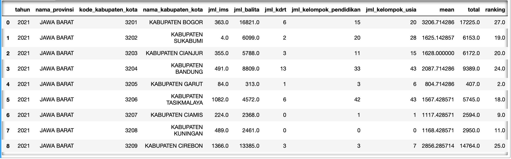

# Dashboard Jabar Sehat
-by Bali Team

## **Backgrounds**
Data kesehatan dapat menjadi referensi dalam pengambilan keputusan untuk membuat kebijakan atau program kesehatan. Namun, terkadang data yang terlalu banyak ada yang tidak lengkap dan tersebar sehingga tidak mudah dibaca langsung, serta menyulitkan dalam memetakan prioritas masalah kesehatan yang ada dan tepat sasaran.

Dari masalah yang ada tersebut, maka dashboard yang kami buat diharapkan dapat membantu memberi insight dalam memetakan prioritas masalah kesehatan di suatu daerah agar bisa mengambil kebijakan atau membuat program kesehatan yang tepat sasaran.


## **Objectives**
Dengan melihat dashboard yang telah kami buat kami harap personas/users kami bisa memprioritaskan daerah mana yang butuh penanganan terlebih dahulu dalam hal masalah kesehatan dan prioritas penyelesaian masalah kesehatan dan kekerasan dalam suatu daerah. Sehingga personas/user dapat membuat suatu kebijakan/program kesehatan yang tepat sasaran. Personas/user yang kami maksud yaitu gubernur/bupati/walikota atau tim yang bisa memutuskan untuk membuat program yang tepat sasaran berdasarkan insight yang terdapat dalam dashboard.


## **Methods**
1. Eksplore dataset yang telah diberikan
2. Menentukan problem yang ingin diselesaikan berdasarkan dataset yang diberikan dan menentukan personas/users dashboard yang akan kita buat.
3. Menentukan feature dan metriks apa saya yang akan kita buat di dalam dashboard.
4. Membuat user flow dan Hifi Prototype.
5. Melakukan wrangling dataset menggunakan python.
6. Membuat dashboard menggunakan Tableau.


## **Wrangling Data**
1. Marge data untuk fitur mapping kasus per kabupaten
```
#copy data
data1 = indeks_.copy()
data2 = keluhan_.copy()
data3 = ibu_.copy()
data4 = bayi_.copy()

#drop column
data1 = data1.drop(['id','kode_provinsi', 'satuan'], axis=1)
data2 =data2.drop(['id', 'kode_provinsi', 'satuan'], axis=1)
data3 =data3.drop(['id', 'kode_provinsi', 'satuan'], axis=1)
data4 =data4.drop(['id', 'kode_provinsi', 'satuan'], axis=1)

#merge
df = data1.merge(data2, on=('kode_kabupaten_kota', 'nama_provinsi', 'nama_kabupaten_kota', 'tahun'), how='outer')
df = df.merge(data3, on=('kode_kabupaten_kota', 'nama_provinsi', 'nama_kabupaten_kota', 'tahun'), how='outer')
df = df.merge(data4, on=('kode_kabupaten_kota', 'nama_provinsi', 'nama_kabupaten_kota', 'tahun'), how='outer')
```

2. Grouping jumlah kasus per kabupaten

```
count_pendidikan = df3_.groupby(['kategori_pendidikan'])[['jml_kelompok_pendidikan']].sum()
count_pendidikan 
```


3. Scoring untuk jumlah kasus yang ada:

```
score['mean'] = score.mean(axis=1)
score['total'] = score['jml_ims'] + score['jml_balita'] + score['jml_kdrt'] + score['jml_kelompok_pendidikan'] + score['jml_kelompok_usia']
score['ranking'] = score['mean'].rank(method='min')
```


## **Exploratory Data Analysis (EDA)**
Dalam penggunaan dashboard ini, pengguna bisa melihat overview atau gambaran besar dari data yang sudah diolah pada halaman depan. Pengguna dapat melihat jumlah kasus per kategori dan atau pertahun sesuai dengan filter yang dipilih.
Untuk analisa yang lebih detail ada pada dashboard halaman kedua, dimana pengguna bisa melihat ranking dari total semua kasus kesehatan dan berkaitan pada suatu daerah. Jika pada suatu daerah memiliki kasus yang banyak, maka daerah tersebut akan ditempatkan pada ranking paling bawah. Dengan demikian, diharapkan pengguna bisa lebih memperhatikan kondisi daerah dengan ranking tersebut dan bisa memutuskan langkah apa yang bisa diambil atau program apa yang dibutuhkan untuk mengatasi masalah kesehatan yang ada pada daerah tersebut.


## **Dashboard**
Mapping per kabupaten menggunakan parameter indeks kesehatan, jumlah ibu hamil, persentase penduduk yang mempunyai keluhan sakit dan bayi bergizi kurang


Analitik tiap kabupaten berdasarkan data tahun 2021(terbaru) dan perbadingan kasus kekerasan berdasarkan tahun 2018 dan 2021


[JABAR SEHAT by Bali Team](https://public.tableau.com/app/profile/zakiahafifah/viz/JABARSEHATbyBaliTeam/Overview2)

## **Analysis**
Dalam penggunaan dashboard ini, pengguna bisa melihat overview atau gambaran besar dari data yang sudah diolah pada halaman depan. Pengguna dapat melihat jumlah kasus per kategori dan atau pertahun sesuai dengan filter yang dipilih.

Untuk analisa yang lebih detail ada pada dashboard halaman kedua, dimana pengguna bisa melihat ranking dari total semua kasus kesehatan dan berkaitan pada suatu daerah. Jika pada suatu daerah memiliki kasus yang banyak, maka daerah tersebut akan ditempatkan pada ranking paling bawah. Dengan demikian, diharapkan pengguna bisa lebih memperhatikan kondisi daerah dengan ranking tersebut dan bisa memutuskan langkah apa yang bisa diambil atau program apa yang dibutuhkan untuk mengatasi masalah kesehatan yang ada pada daerah tersebut.


## **Conclusion**
Hasil analisis dari dashboard berupa pemetaan prioritas daerah mana yang memerlukan tindakan cepat untuk mengatasi masalah kesehatan. Ranking terbawah berarti banyaknya kasus kesehatan yang perlu diatasi. Selain menentukan prioritas pada daerah berdasarkan ranking, kita bisa melihat dengan jelas angka-angka yang memiliki masalah terbanyak, dari situ bisa diambil keputusan masalah apa yang lebih memerlukan perhatian lebih dahulu sehingga kebijakan dan atau program kesehatan bisa tepat sasaran.


## **Pendukung**
   - User flow: [miro](https://miro.com/app/board/uXjVOsMyJiA=/)
   - Prototype: [project lab – Figma](https://www.figma.com/file/UuWvs64PPvXcC5CJwMe0jb/project-lab)
   - Dashboard: [JABAR SEHAT by Bali Team](https://public.tableau.com/app/profile/zakiahafifah/viz/JABARSEHATbyBaliTeam/Overview2)


## **Reference**
- [PRD ref1](https://drive.google.com/file/d/1jbfm31jSBkfBgnfbfDTUQIrhds4lF5gf/view?usp=sharing)
- [PRD ref2](https://drive.google.com/file/d/1KBTY0EPVFAbvWxQJ3b0pEXzaCZ82tdrP/view?usp=sharing)
- [Dashboard fitur ref](https://public.tableau.com/views/BPJS_16127065341570/Dashboard1?:language=en-US&:display_count=n&:origin=viz_share_link)
- [Dashboard design ref](https://public.tableau.com/views/HospitalityDashboardRWFD_16388048733680/Overview?:language=en-US&:display_count=n&:origin=viz_share_link)
